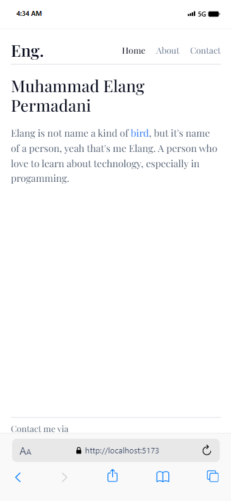
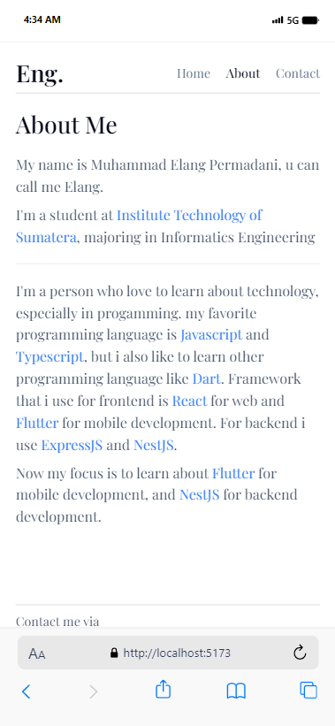
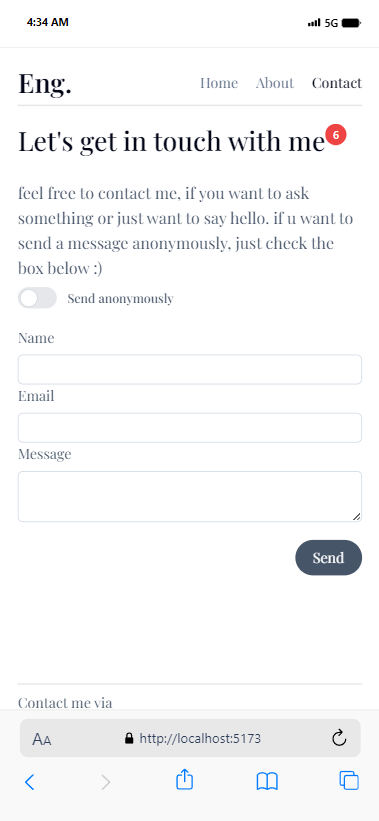
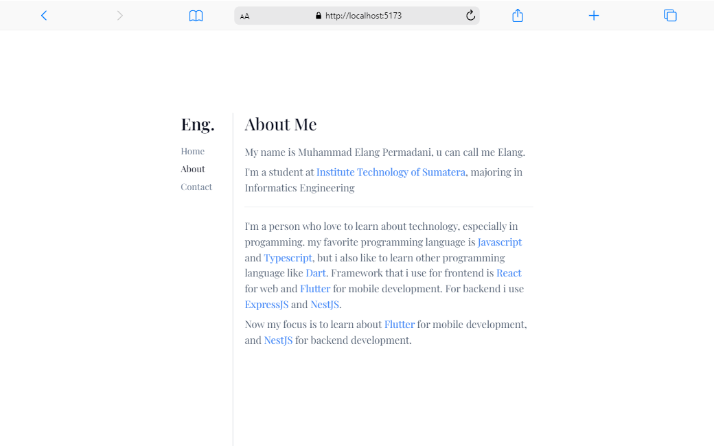
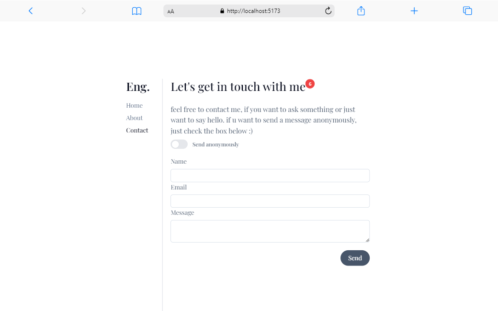

# Tugas 3 Pemograman Web Lanjut

## Tech Stack

- [React](https://reactjs.org/)
- [Tailwind CSS](https://tailwindcss.com/)
- [Vite](https://vitejs.dev/)
- [TypeScript](https://www.typescriptlang.org/)
- [React Router](https://reactrouter.com/)
- [SWR](https://swr.vercel.app/)
- [Hot Toast](https://jossmac.github.io/react-hot-toast/)

## How to run

1. Clone this repository

```bash
git clone https://github.com/maybeenang/PWL-Tugas-3.git
```

2. change directory to this repository

```bash
cd PWL-Tugas-3
```

3. Install dependencies

```bash
npm install
```

4. Build the project

```bash
npm run build
```

5. Run the project

```bash
npm run preview
```

6. Open your browser and go to `localhost:5173`

## Screenshots

| Home Page                                 | About Page                                  | Contact Page                                    |
| ----------------------------------------- | ------------------------------------------- | ----------------------------------------------- |
|  |  |  |

## Stateless and Stateful Component

| ScreenShot                                     | Description                                                                                    |
| ---------------------------------------------- | ---------------------------------------------------------------------------------------------- |
|  | just render a static content wihout any changes                                                |
|   | the badge at the top right title can be changes depends on how many message that has been sent |

## Live Demo

not available yet
